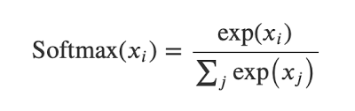
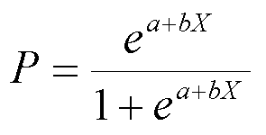

```{r setup, include=FALSE}
knitr::opts_chunk$set(echo = TRUE)

# set working directory
setwd("C:/Users/Eugen/Desktop/PM616 - Assignment 1")

# libraries
library(tidyverse)
library(keras)
```

# 1. The Titanic dataset.

(a) Play with the Titanic dataset to predict the survival status. Do exploratory analyses and clean up the data when necessary. Do all model training and tuning on the training set. Turn in your final prediction model and the predictions on the test set (as a 418 × 2 object or a file with two columns: PassengerId, Survived).

#### Load Data
```{r}
train <- read_csv('train.csv')
test <- read_csv('test.csv')
```

####  Check for missing
```{r}
sapply(train, function(x) sum(is.na(x)))
```

####  Drop Missing
```{r}
train <- na.omit(train) 
```


####  Visualizations

####  Histograms for numerical variables
```{r}
train %>% select(-PassengerId) %>%
  keep(is.numeric) %>% 
  gather() %>% 
  ggplot(aes(value)) +
  facet_wrap(~ key, scales = "free") +
  geom_histogram()
```

#### Embarked vs. Survived
```{r}
train2 <- 
  train %>%
  group_by(Embarked, Survived) %>% 
  tally()

train2 <- 
  drop_na(train2)

ggplot(train2, aes(x = Embarked, y = n, fill = factor(Survived))) + 
  geom_bar(stat = 'identity', position = 'dodge')
```

#### Sex vs. Survived
```{r}
train3 <- 
  train %>%
  group_by(Sex, Survived) %>% 
  tally()

train3 <- 
  drop_na(train3)

ggplot(train3, aes(x = Sex, y = n, fill = factor(Survived))) + 
  geom_bar(stat = 'identity', position = 'dodge')
```

#### Age vs. Survived
```{r}
ggplot(train, aes(x = Age, fill = factor(Survived), colour = factor(Survived))) +
  geom_histogram(alpha = 0.5, position = "identity")
```

#### Fare vs Survived
```{r}
ggplot(data = train, aes(log(Fare), color = factor(Survived))) +
  geom_boxplot()
```

#### Data Cleanup
```{r}
# sex
train$Sex <- ifelse(train$Sex == 'male', 1, 0)

# Embarked
train$Embarked_C <- ifelse(train$Embarked == 'C', 1, 0)
train$Embarked_Q <- ifelse(train$Embarked == 'Q', 1, 0)
train$Embarked_S <- ifelse(train$Embarked == 'S', 1, 0)

# remove variables
train <- 
  train %>%
  select(-c(PassengerId, Name, Ticket, Cabin, Embarked))
```

#### Define Data/Labels
```{r}
# x train
x_train <- train %>% select(-c(Survived))
x_train <- as.matrix(x_train)
dimnames(x_train) = NULL
# y train
y_train <- as.matrix(train$Survived)
dimnames(y_train) = NULL

# x test
x_test <- as.matrix(test)
dimnames(x_test) = NULL
```


#### Model
```{r}
model <- keras_model_sequential() %>%
  layer_dense(units = 16, activation = "relu", input_shape = (9)) %>%
  layer_dense(units = 16, activation = "relu") %>%
  layer_dense(units = 1, activation = "sigmoid")
```

#### Compile the Model
```{r}
model %>% 
  compile(
  optimizer = "adam",
  loss = "binary_crossentropy",
  metrics = c("accuracy")
)
```

#### Fit Model
```{r}
history <- 
  model %>% 
  fit(x_train,
      y_train,
      epoch = 200,
      batch_size = 32,
      validation_split = 0.1,
      verbose = 2)
```

#### Plot History
```{r}
plot(history)
```

#### Evaluate
```{r}
model %>% 
  evaluate(x_train,
           y_train)
```


(b) There are many analysis demonstrations of this dataset online, both in R and Python. Do not look at them. Try to get as much as possible yourself. Then look at other people’s solutions online (by just googling). Summarize what you have learned from them, and if you did something better than most of online demonstrations, briefly highlight them.

I learned that a lot of individuals pay close attention to missing parameters. There are methods of imputation and machine learning algorithms to predict missing values. A lot of time also seems spent on the feature engineering aspect. There was a notebook that used NLP techniques to extract meaningful data from the passenger's name.

***

# 2. Show the following:

(a) For binary outcomes, an ANN model without any hidden layer and with a softmax output layer is equivalent to logistic regression.

Softmax Equation:


- where (z1, · · · , zK) are the input values to the K nodes in the final layer.

Logistic Regression Equation:


- For binary outcomes, an ANN model without any hidden layer and with a softmax output layer s equivalent to logistic regression


(b) For categorical outcomes with more than two outcome categories, an ANN model without any hidden layer and with a softmax output layer is equivalent to multinomial logistic regression.

(c) Simulate a small dataset (with n = 1000) with a binary outcome. Fit a logistic regression model and an ANN model without any hidden layer. Compare the results.
#### Simulate dataset
```{r}
set.seed(16)
a <- rnorm(n = 1000, mean = 50, sd = 20)
b <- rnorm(n = 1000, mean = 50, sd = 20)
c <- rnorm(n = 1000, mean = 50, sd = 20)
y <- rbinom(1000, 1, .5)

x1 <- data.frame(a, b, c, y)
x2 <- cbind(a, b, c)
```

#### Logistic Regression
```{r}
# Logistic Regression Model
model1 <- glm(y ~ a + b + c, data = x1, family = "binomial")
summary(model1)
```
```{r}
# confusion matrix
library(caret)

# predict
predicted <- predict(model1, x1, type="response")
predicted <- ifelse(predicted > 0.5, 1, 0)

#create confusion matrix
confusionMatrix(factor(x1$y), factor(predicted))
```

#### Neural Network
```{r}
model2 <- keras_model_sequential() %>%
  layer_dense(units = 1, activation = "softmax")
```

#### Compile the Model
```{r}
model2 %>% 
  compile(
  optimizer = "adam",
  loss = "binary_crossentropy",
  metrics = c("accuracy")
)
```

#### Fit Model
```{r}
history2 <- 
  model2 %>% 
  fit(x2,
      y,
      epoch = 200,
      batch_size = 32,
      validation_split = 0.1,
      verbose = 2)
```

#### Plot history
```{r}
plot(history2)
```

